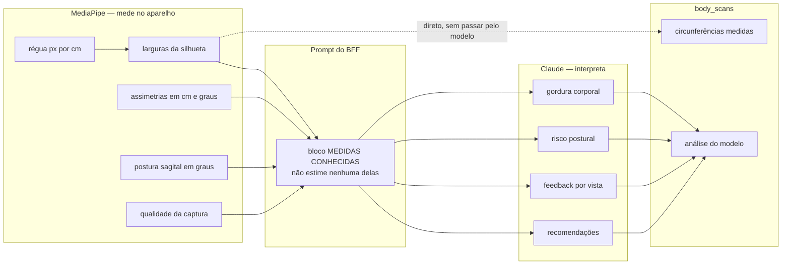
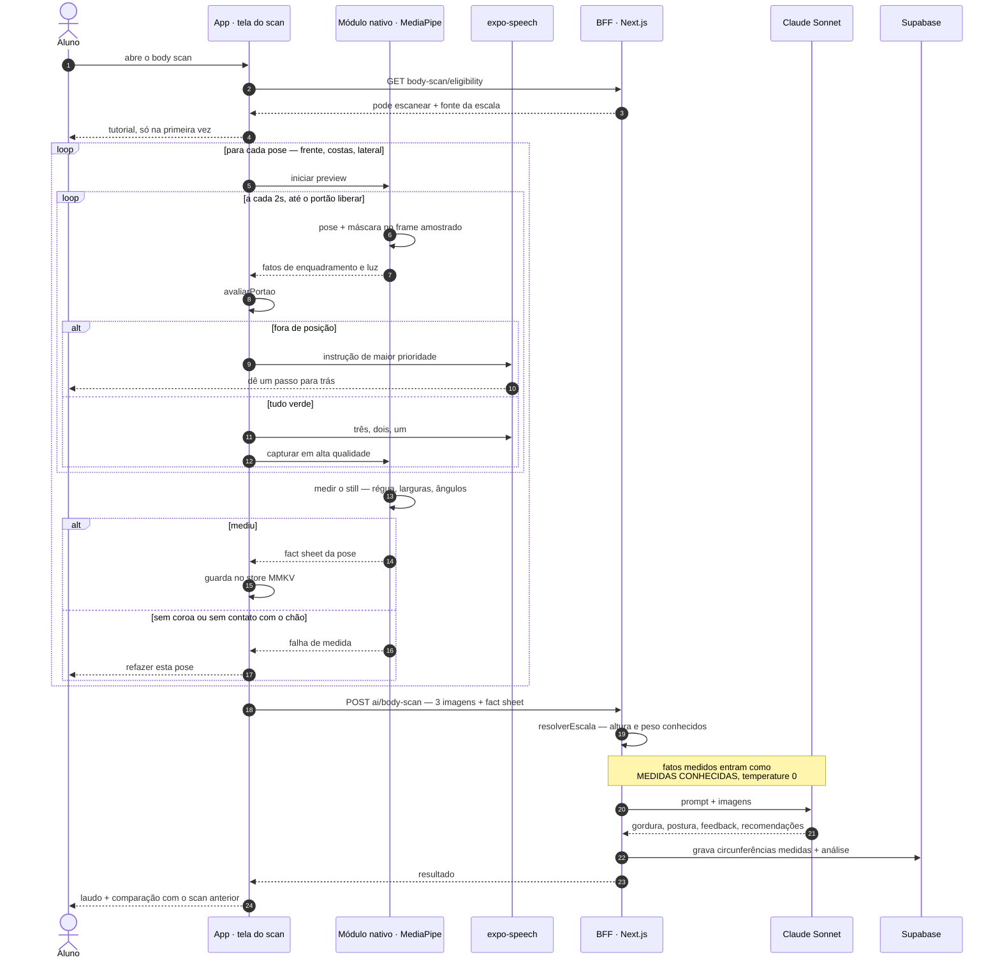
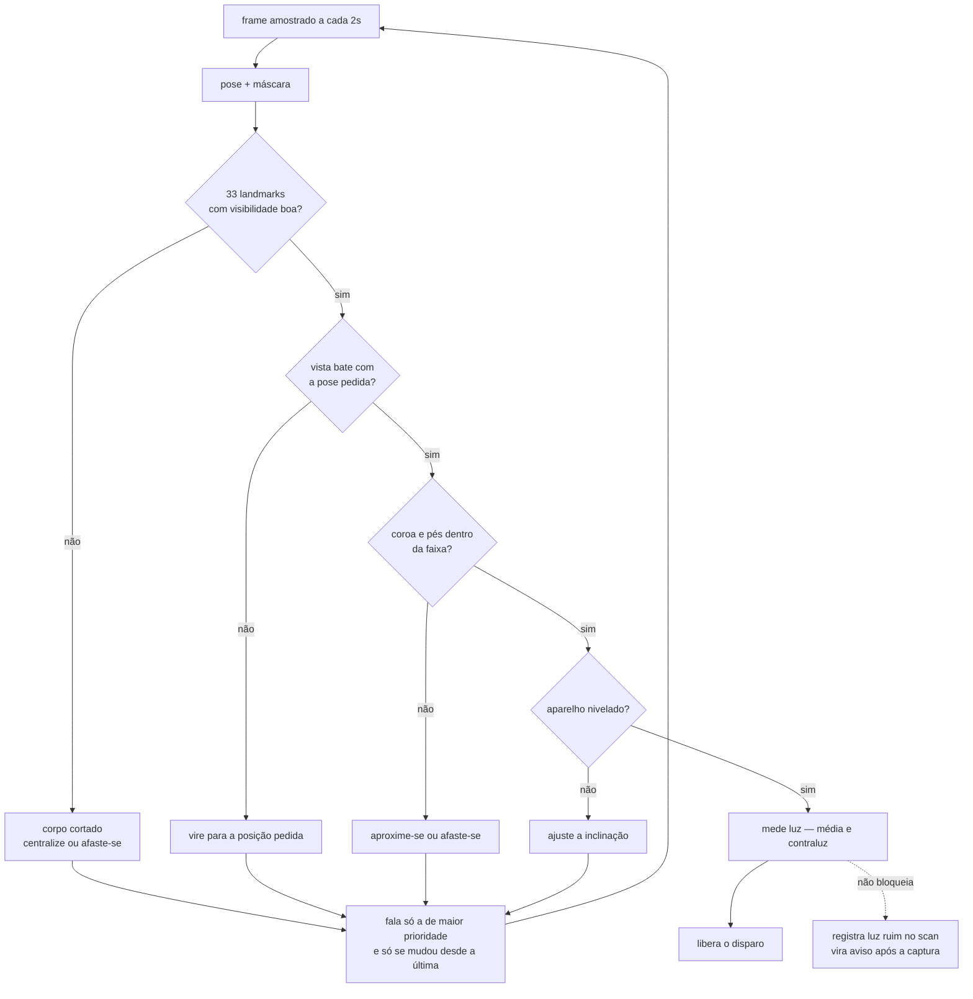

# O aparelho mede, o modelo interpreta

**Data:** 2026-08-30
**Status:** proposed — a Fase 0 promove para `accepted`
**Versão navegável:** [`0022-o-aparelho-mede-o-modelo-interpreta.html`](0022-o-aparelho-mede-o-modelo-interpreta.html) — mesmos diagramas, renderizados. Este arquivo é o canônico.

---

## Contexto

O [ADR-0010](0010-body-scan-calibrado.md) afirma que a análise corporal é calibrada por regra
de três:

> Se o aluno tem 175 cm e ocupa 900 px da cabeça ao pé, o frame tem 5,14 px/cm, e qualquer
> largura na imagem converte para centímetro por regra de três.

**Esse cálculo nunca existiu no código.** Não há `px_por_cm` em nenhum lugar do repositório. O que
existe é uma instrução no prompt do BFF mandando o modelo converter as larguras "a partir dessa
proporção" — ou seja, quem localiza a cabeça e os pés em pixels é o próprio Claude, no olho, a
cada chamada.

As marcas fixas em `BodyScanCamera` (10% e 90% da altura da tela) são a única coisa segurando a
escala, e só funcionam se o aluno encostar exatamente nelas. Ninguém verifica se ele encostou. Se
ele para quatro centímetros abaixo da marca, a régua erra ~2% e todas as circunferências saem
deslocadas juntas, com aparência de número legítimo.

Dois agravantes encontrados junto:

- A chamada em `web/src/app/api/ai/body-scan/route.ts` **não define `temperature`**, então roda no
  padrão 1.0. A mesma foto enviada duas vezes devolve cintura diferente. Parte da "variação" entre
  janeiro e março é o modelo tendo sorteado outro valor — e o ADR-0010 apoia a confiabilidade do
  delta em erro sistemático que se cancela, o que amostragem aleatória não faz.
- `muscle_mass_kg` é massa em quilos vinda de uma foto. O ADR-0010 apagou a estimativa de peso com
  a frase "peso é massa, e nenhuma câmera mede massa" e deixou este campo em pé, na mesma unidade,
  saindo do mesmo lugar.

## Opções consideradas

### Opção A — MediaPipe mede a geometria; o modelo interpreta

- **Prós:** a régua deixa de ser suposição e vira medida; o que é geométrico fica determinístico e
  testável com imagens de fixture; o modelo continua fazendo aquilo em que é bom, agora sobre
  fatos; processamento biométrico acontece no aparelho e nada novo atravessa a fronteira.
- **Contras:** dependência nativa, com iOS bloqueado até o primeiro build existir; superfície
  nativa própria para manter a cada upgrade de SDK; a máscara mede o tecido, não o corpo.

### Opção B — Só melhorar o enquadramento, sem modelo local

- **Prós:** nenhuma dependência nativa, entrega em dias, iOS acompanha.
- **Contras:** silhueta desenhada na tela não verifica nada — é a solução que já está lá e que
  falhou. Sem detectar a pessoa não há como saber se ela encostou nas marcas, e a régua continua
  inexistente. Melhora a foto que entra num passo que continua chutando.

### Opção C — Mover tudo para o aparelho; o modelo faz só o qualitativo

- **Prós:** determinismo total nos números; chamada de IA menor e mais barata.
- **Contras:** landmark é centro de articulação e máscara é contorno de roupa — nenhum dos dois
  entrega composição corporal. Gordura viraria fórmula antropométrica encadeada sobre estimativa,
  e o especialista perderia leitura clínica que hoje o modelo faz bem.

### Opção D — API comercial de medidas corporais

- **Prós:** o problema inteiro resolvido por quem só faz isso, com dado de validação.
- **Contras:** pago por scan, imagem sai do país, lock-in. Troca a melhor posição de LGPD da lista
  pela pior, para resolver a parte do problema que é justamente a menos crítica.

## Decisão

**Escolhemos a A, com a fronteira desenhada pela natureza da grandeza.**

- **Geometria — o aparelho mede.** Distância, largura, ângulo, razão. São coisas que a imagem
  contém e que uma conta extrai. Não há julgamento envolvido, e o resultado é reprodutível.
- **Composição e julgamento clínico — o modelo estima e interpreta.** Percentual de gordura, risco
  postural, feedback por vista, recomendações. Exigem leitura, e é onde o modelo é bom **quando
  tem fatos**.

O fator decisivo é que **as duas coisas falham por motivos opostos**. Um modelo de linguagem
localizando bordas em pixels erra sem saber que errou, e erra diferente a cada chamada. Uma conta
sobre landmarks não interpreta nada, mas também não inventa. Cada um fazendo o que não sabe fazer
era a origem de todos os números frágeis desta feature.

Os fatos medidos entram no prompt **dentro do bloco que já existe** para altura e peso —
`MEDIDAS CONHECIDAS DO ALUNO (não estime nenhuma delas)` — só que muito maior. O modelo é
enriquecido, não substituído.

### O módulo é próprio, e não VisionCamera

Frame processors do VisionCamera exigem `react-native-worklets-core`. O app tem
`react-native-worklets` 0.10.1, que o Reanimated 4.5.1 traz. Os dois no mesmo projeto colidem no
Android com `WorkletsPackage` duplicado. Um Expo Module próprio, dono da própria preview, não
passa por worklets nenhum: ele amostra nativamente e emite para o JS um objeto pequeno a cada dois
segundos. Nenhum frame cruza a ponte.

## Como o processo funciona

Só as circunferências têm caminho direto ao banco. O motivo é que duas fontes para a mesma grandeza
não têm critério de desempate: se o modelo devolvesse circunferência tendo o número medido no
prompt, o que iria para o banco seria o amostrado, com o medido servindo de sugestão ignorável.

### A captura, ponta a ponta

As três fotos continuam saindo para o serviço externo, porque a análise postural depende delas. O
que muda é que agora viajam acompanhadas de fatos medidos — e a imagem segue sem ser persistida.

### O portão

A ordem não é arbitrária: vai da checagem que invalida a foto inteira para a que apenas degrada. A
primeira que falhar produz a instrução, e nada mais é dito — uma correção por vez, e silêncio
significa que está bom.

**Geometria trava. Luz não trava.** Um aluno às dez da noite no quarto pode não ter como resolver
o contraluz, e scan marcado vale mais que scan que não aconteceu. O precedente é da 0027:
`framing_level_sensor: false` já significa "este sinal não conta para este scan".

### O consentimento

O texto atual em `elegibilidade.ts` promete: *"As imagens vão para um serviço de inteligência
artificial externo e não são guardadas — só o resultado fica salvo."* Isso descreve **três fotos
que o aluno tira**. A partir daqui o aparelho passa a olhar sozinho, a cada dois segundos,
enquanto a tela está aberta.

Não armazenar não é não tratar: o Art. 5°, X inclui coleta, acesso e processamento. O texto é
reescrito separando as duas coisas — o que roda no aparelho e morre lá, e o que sai para o
serviço externo — e **`POLICY_VERSION` sobe de `1.1` para `1.2`**. O mecanismo já existe:
`hasCollectionConsent` devolve `false` quando a versão não bate, então o reconsentimento acontece
sozinho. É o mesmo motivo da `1.1`, que a própria docstring registra: *"não faltava autorização,
faltava o aluno saber."*

**Minimização — a alternativa recusada, registrada.** Amostrar só dentro da contagem regressiva
entregaria o mesmo portão tratando estritamente menos imagem, com começo e fim claros. Escolhemos
a amostragem contínua para a correção chegar **enquanto o aluno se posiciona**, e não só depois de
ele iniciar a contagem — que é o momento em que ele ainda está longe da tela e mais precisa da
voz. O custo é uma janela de tratamento maior, e ele está sendo pago de olhos abertos, com o
consentimento dizendo isso na cara.

### Quando a medida falha

A máscara vai falhar às vezes — pé cortado no rodapé, camisa branca contra parede branca, cabelo
volumoso. **A foto é recusada, e nunca há queda para o método antigo.** O fallback reintroduziria
dois métodos na mesma série, invisivelmente e para sempre, decidido por acaso de iluminação.
Recusar é barato porque o portão é ao vivo: o aluno está em pé no lugar, a dois passos da pose
certa.

## O que o `/lgpd-check` exigiu

O parecer rodou em 2026-08-30 e mudou o escopo em quatro pontos. Os dois primeiros viram código,
os dois últimos viram regra de revisão.

**`body_scans_own` deixa de ser `FOR ALL`.** Hoje o aluno pode dar UPDATE na própria análise. Era
tolerável enquanto os números eram estimativa do modelo; com eles virando **medida**, adulterar
passa a ter consequência, e a tabela deixa. É a mesma falha que a `0036` corrigiu em
`workout_sessions` — lá a doc dizia que o histórico era imutável e o banco discordava. Vira
INSERT/SELECT/DELETE: o DELETE fica, porque o direito de exclusão por item depende dele.

**Os campos novos aparecem para o aluno**, não só para o especialista. Régua, larguras e ângulos
são dados sobre o corpo dele (Art. 18, II). Coluna que só o profissional lê é tratamento sem livre
acesso.

**O fact sheet nunca entra em log.** *"Desnível de ombro de 1,8 cm"* é inferência sobre saúde de
titular identificado — a mesma regra que já vale para o sinal de inatividade do briefing.

**Achado colateral, já corrigido:** `body_scans` — que a `0017` chama de *"o dado mais sensível do
schema"* — não tinha **nenhum** teste comportamental de RLS. Só a checagem estrutural de que a
política existe. A trava foi escrita e provada negativamente: afrouxando a política num escopo
descartável, o aluno B passou a ler a análise do aluno A, e o teste acusa.

### Travas

| Trava | Estado |
|---|---|
| `verify-rls.sql` — aluno não lê análise de outro aluno; especialista sem vínculo não lê nenhuma | ✅ escrita, passando, prova negativa feita |
| `aiBodyScan` — a imagem não é codificada sem consentimento (Art. 11, I) | nasce com a feature |
| `route` — a circunferência gravada é a do payload medido, nunca a que o modelo devolveu (Art. 6°, V) | nasce com a feature |
| `route` — nenhum valor do fact sheet aparece em log (Art. 6°, VIII) | nasce com a feature |

## Consequências

**Fica mais fácil**

- Defender o número: a régua vira medida com erro caracterizável, no lugar de uma localização
  visual que muda a cada chamada.
- Testar: `analisarCaptura` e `avaliarPortao` rodam sobre imagens de fixture, sem câmera, sem
  device, sem rede. Hoje não há nada testável nesse caminho.
- Escrever o laudo: "ombro direito 1,8 cm acima do esquerdo, linha a 2,3° da horizontal" no lugar
  de "ombro direito elevado".
- Instruir o aluno: o app passa a dizer *o que* corrigir, por voz, enquanto ele está longe da tela.

**Fica mais difícil**

- Toda subida de Expo SDK passa a poder exigir rebuild do módulo nativo. É dívida permanente.
- O iOS fica sem body scan até o primeiro build existir.
- **O app engorda ~15 MB no arm64.** Medido no spike com `tasks-vision:0.10.35`:
  `libmediapipe_tasks_jni.so` tem 10,5 MB no arm64-v8a, mais ~5 MB do
  `pose_landmarker_lite.task`. Baixando o modelo sob demanda, a instalação sobe ~10 MB e o
  resto vem no primeiro scan.
- **A versão do MediaPipe importa mais do que parece.** A 0.10.14 **não publica `x86_64`**, o que
  a torna impossível de rodar em emulador moderno — só a 0.10.35 cobre a ABI. Fixar a versão e
  conferir as ABIs do `tasks-core` é parte do trabalho, não detalhe.
- **Todo aluno consente de novo.** A `POLICY_VERSION` sobe para `1.2`, e quem já autorizou é
  perguntado outra vez antes do próximo scan. É o preço de o texto passar a ser verdade.
- Roupa larga passa a produzir número **preciso e errado**, que é pior que impreciso e errado,
  porque parece confiável. A mitigação é o tutorial, não o código — e vale registrar que isso
  atinge o modelo do mesmo jeito: ele também só vê o tecido.

**O que isto bloqueia**

- Circunferência medida substituir a do modelo depende de validação contra as fitas já gravadas em
  `physical_assessments`: 5 pessoas, tolerância ±3 cm em cintura e quadril. Reprovando, essa parte
  não entra e o resto segue valendo.
- Rastreio de exercício usa a mesma engine e **não** entra aqui. A interface do módulo é desenhada
  só para o body scan; o segundo consumidor paga o seam.

**Consequência administrativa**

Como não há nada em produção, o método antigo **sai do código junto** — sem coluna de método, sem
`compareScans` checando procedência, sem rótulo na tela. Um marcador para distinguir de um método
recém-apagado seria seam hipotético. Os scans de teste vão junto, no molde da 0037: avaliação
incompleta se apaga, não se completa.

## Como reverter (se necessário)

Se o módulo nativo se mostrar insustentável — build quebrando a cada SDK, ou desempenho abaixo do
que o laço de voz exige —, o caminho de volta é a **Opção B**: o módulo sai, `expo-camera` volta a
desenhar a preview, e o prompt volta a pedir a proporção. Custa reescrever `BodyScanCamera` e
perder a régua.

O que **não** se reverte é `temperature: 0` nem a saída de `muscle_mass_kg` como massa em quilos
estimada por foto. Essas duas não são trade-off; são defeito.

---

## `body_scans.muscle_mass_kg` vira `lean_mass_kg`

O nome mente hoje. O valor sai de `peso × (1 − gordura)`, e essa conta devolve **massa magra** —
que inclui osso, órgão e água. Chamar isso de massa muscular afirma uma discriminação de tecido
que nenhum dos dois lados do cálculo faz.

E a interface já sabia disso antes do banco: `ScanComparison` no mobile e `BodyScanHistory` no web
já rotulam o campo como **"Massa magra"**. Quem estava desalinhado era o schema.

Junto com o nome muda a origem: o valor deixa de ser um número livre que o modelo devolve e passa
a ser **derivado** de peso conhecido e da gordura estimada. Determinístico, com a conta explícita.

**A coluna homônima de `physical_assessments` NÃO é renomeada.** Lá a massa vem do protocolo
Jackson-Pollock de 7 dobras, medido com adipômetro pelo especialista — é medida por protocolo
validado, não inferência sobre foto. Renomear as duas por simetria apagaria justamente a
diferença que importa.

Pela [ADR-0019](0019-coluna-substituida-sai-na-mesma-migration.md), a coluna antiga sai na mesma
migration que cria a nova. Alcance do rename: `body_scans.muscle_mass_kg`, os tipos em
`bodyScan.types.ts`, `ComparableField`, `database.types.ts`, o schema Drizzle, `muscleMass` no
contrato do BFF, e as chaves de rótulo nas duas telas — cujo texto visível já está certo.
