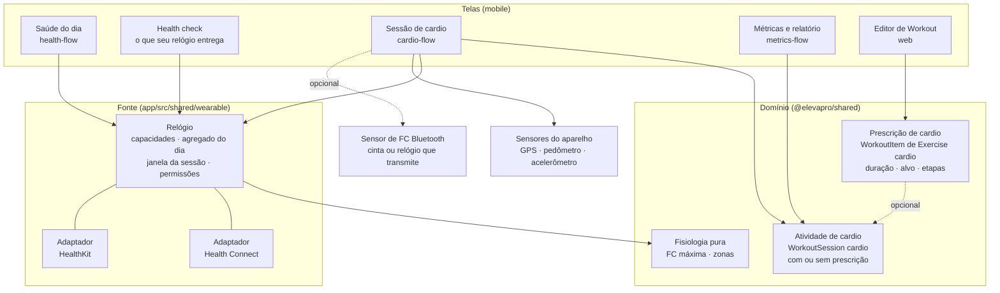
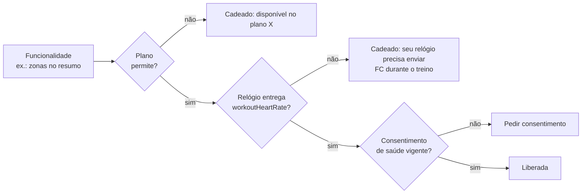
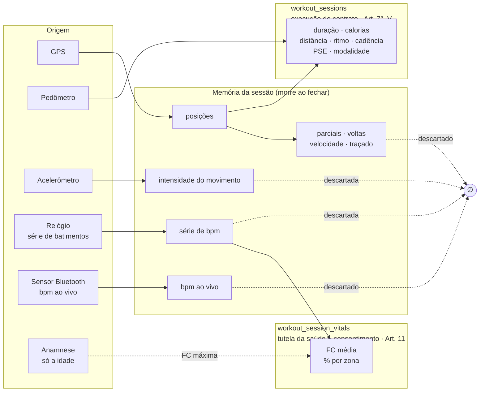
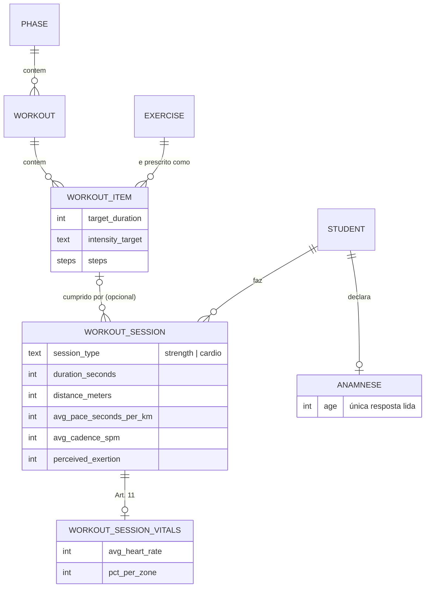
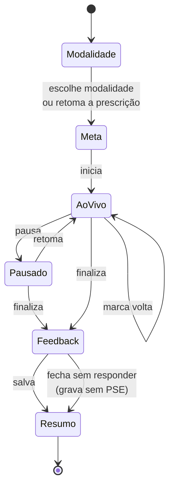
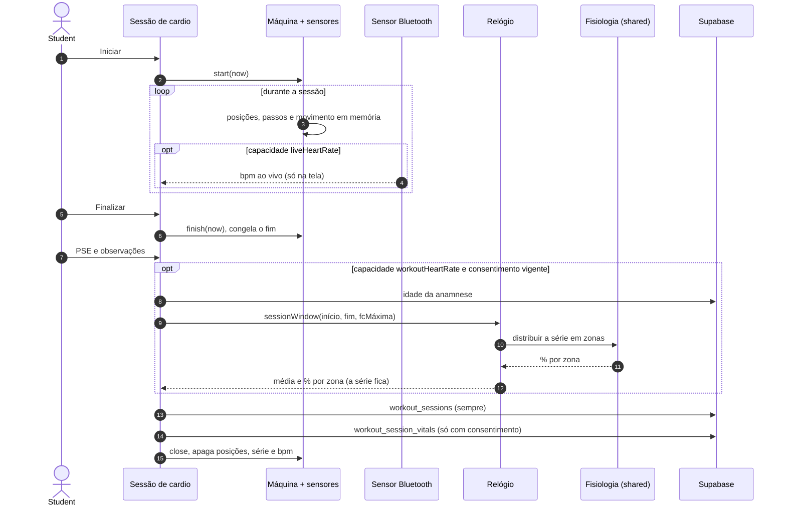
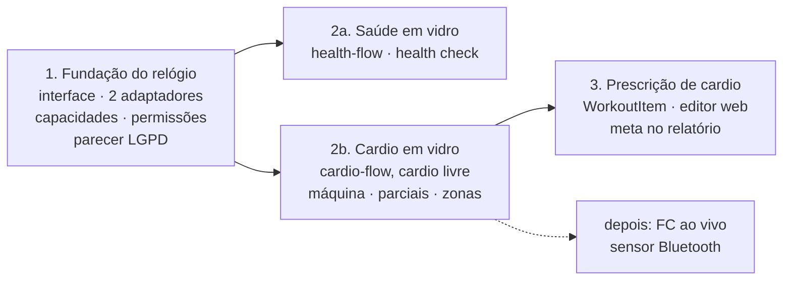

# O cardio é atividade, a prescrição é opcional, e o relógio é uma fonte só

O cardio fica entre dois lugares: é treino, porque o especialista prescreve e
acompanha, e é saúde, porque mede corpo. Até agora cada feature que tocou nele
resolveu isso por conta própria. Este ADR fixa a forma em três peças: a
**atividade de cardio** (o que foi feito, com ou sem prescrição), a **prescrição
de cardio** (opcional, como item de um Workout) e o **Relógio** (a única porta
para Health Connect e HealthKit, que a saúde do dia e o cardio usam). O app
suporta **qualquer relógio** que escreva nessas plataformas, e cada
funcionalidade é liberada pelo dado que o relógio do Student de fato entrega. O
dado se separa pela **base legal**, e não pela tela onde aparece.

**Status:** proposed. Vira `accepted` quando as questões em aberto do fim forem
fechadas e o parecer do `/lgpd-check` for escrito.

Estende o [ADR-0024](0024-a-corrida-se-mede-e-o-caminho-nao-se-guarda.md): a
sessão passa a guardar também a distribuição em zonas de FC, além da média. A
série de batimentos continua nunca persistida, como mandam o
[ADR-0018](0018-metrica-de-saude-so-agregada-por-dia.md) e o ADR-0024. O que o
mercado faz e o que as plataformas de saúde entregam está pesquisado em
[`docs/research/zepp-coach.md`](../research/zepp-coach.md).

## Contexto

Três fluxos do kit do mobile se cruzam e foram desenhados em separado:

| Fluxo do kit | O que ele traz do cardio |
|---|---|
| `cardio-flow-glass.html` | ritmo alvo, sessão intervalada sugerida, bpm ao vivo, voltas, parciais por km, zonas de esforço no resumo |
| `health-flow-glass.html` | permissão "FC durante o treino" ao lado de passos, sono e FC de repouso; health check avisa quando falta |
| `metrics-flow-glass.html` | "Sessões de cardio 18 / 24" no relatório do período, uma meta de frequência |

E no código a mesma pergunta foi respondida duas vezes:

- [`useHealthData.ts`](../../app/src/hooks/useHealthData.ts) lê o agregado do
  dia do relógio;
- [`frequenciaDaSessao.ts`](../../app/src/modules/workout/services/frequenciaDaSessao.ts)
  lê a janela da sessão.

Cada um tem o próprio caminho para Health Connect e HealthKit, a própria forma
de pedir permissão e a própria regra de que nulo é ausência de leitura. A
terceira leitura (zonas) seria a terceira cópia.

Além disso, o cardio é a única atividade do produto **sem lado prescrito**:

| | Prescrito | Feito |
|---|---|---|
| Treino | Periodization → Phase → Workout → WorkoutItem | WorkoutSession |
| Dieta | DietPlan → DietMeal | MealLog |
| Cardio | **nada** | WorkoutSession `session_type = cardio`, modalidade em texto livre |

## Decisão

### 1. Três peças, e as telas só consomem



- **Relógio** (`wearable` no código, ADR-0027) é o módulo fundo que falta: uma
  interface pequena atrás da qual ficam as duas plataformas, as permissões por
  tipo, a detecção de capacidades, o filtro de valor plausível e a regra do
  nulo. Aqui a seam é real, porque já existem dois adaptadores. Mora em
  `app/src/shared/wearable/`, porque as bibliotecas são nativas e porque módulo
  não importa módulo: `health` e `workout` o consomem pelo mesmo caminho.
- **Atividade de cardio** é o feito. Mora no treino, e o dado vital dela fica
  em tabela separada, como o ADR-0024 já decidiu.
- **Prescrição de cardio** é opcional. Quando existe, dá meta, alvo e
  frequência. Quando não existe, a atividade vale por inteiro.
- **Fisiologia pura** (FC máxima estimada e distribuição em zonas) são funções
  sem efeito no `@elevapro/shared`, para o web e o mobile calcularem igual.

**Teste da deleção.** Apagar o Relógio faz reaparecer, em cada chamador
(saúde do dia, health check, sessão de cardio, onboarding), a escolha de
plataforma, o pedido de permissão, a detecção do que chega e a distinção entre
nulo e zero, que já foi defeito real (`hasRecords`). Ele se paga.

### 2. Qualquer relógio, e a funcionalidade é liberada pelo que ele entrega

O app não integra marca nenhuma. Garmin, Samsung, Amazfit, Apple Watch, Polar e
qualquer outro relógio que escreva no Health Connect ou no HealthKit são
suportados do mesmo jeito. Cada funcionalidade declara de que **capacidade**
precisa, e o Student vê o que o relógio dele libera e o que falta.

**A capacidade é detectada pela evidência, não pela permissão.** O HealthKit,
por privacidade, não conta ao app se a leitura foi negada: o app só vê que não
chega nada. O Health Connect conta a permissão, mas não se o relógio grava
aquele tipo. Então as duas plataformas são julgadas igual: há dado recente
daquele tipo? A detecção roda no aparelho, ao abrir o health check e na
sincronização diária, e não é gravada no servidor.

| Capacidade (código) | O relógio precisa enviar | Como detectamos | Libera |
|---|---|---|---|
| — (sem relógio) | nada | — | Plano do Assistente, carga por PSE e adaptação por regra (ADR-0028), sessão guiada por GPS, parciais, pacer, voz, calorias por MET |
| `dailyActivity` | passos e calorias ativas | total diário nos últimos 7 dias | meta de atividade do dia; caloria do relógio no lugar da estimativa por MET |
| `sleepAndRestingHr` | sessão de sono e FC de repouso | registros nos últimos 7 dias | nota de recuperação, que entra na adaptação do plano |
| `workoutHeartRate` | FC durante o exercício | amostras de FC densas dentro de uma sessão de exercício recente (densidade mínima a calibrar) | FC média, zonas no resumo, recuperação da FC |
| `exerciseSessions` | sessão de exercício registrada pelo relógio | registro de exercício nos últimos 14 dias | importar o cardio feito sem abrir o app |
| `hrv` | VFC noturna | registros de VFC nos últimos 7 dias | recuperação pela tendência da VFC |
| `vo2Max` | VO₂ máx. estimado pelo relógio | registro de VO₂ máx. | mostrar e acompanhar a tendência |
| `liveHeartRate` | FC transmitida por Bluetooth no perfil padrão de frequência cardíaca | sensor pareado e transmitindo | zona e alerta **durante** o treino |

- **FC ao vivo não passa pelo Health Connect nem pelo HealthKit.** Nenhuma das
  duas é canal ao vivo: o relógio grava depois, quando sincroniza. O único
  caminho genérico é o sensor Bluetooth no perfil padrão de FC, que cintas
  peitorais e alguns relógios com modo de transmissão oferecem. É capacidade
  à parte, com dependência nativa própria.
- **VFC não é comparável entre plataformas.** O Health Connect guarda RMSSD e o
  HealthKit guarda SDNN. A recuperação usa a tendência do próprio Student, nunca
  o número absoluto nem a comparação entre pessoas.
- **Tipo lido é tipo pedido.** Cada capacidade só entra na lista de permissões
  quando a funcionalidade que ela libera existe. Pedir hoje VFC ou VO₂ máx.
  "para depois" é o critério que a `LGPD_COMPLIANCE.md` §2.3 rejeita.
- **A funcionalidade bloqueada diz o porquê**, nunca some em silêncio: "Para ver
  suas zonas, seu relógio precisa enviar a frequência cardíaca durante o treino
  ao Health Connect". O health check lista as capacidades com o que cada uma
  libera.
- **Capacidade é uma de três travas.** A funcionalidade aparece quando o plano
  de assinatura permite (ADR-0028, desenhado na #160), o relógio entrega e,
  para dado de saúde, o consentimento está vigente.



### 3. O dado se separa pela base legal

"O cardio é treino ou saúde?" já tem resposta no banco: os dois, e a linha que
os separa é a base legal. Toda medida nova do cardio entra por esta regra, e
não pela tela onde aparece.



- **O que é contrato** (duração, distância, ritmo, cadência, PSE) grava sempre,
  com ou sem consentimento de saúde.
- **O que é Art. 11** (FC média e zonas) só grava com consentimento vigente, e
  a RLS de `workout_session_vitals` fecha a leitura do especialista quando o
  aluno revoga.
- **Parciais, voltas, velocidade, traçado e bpm ao vivo** são calculados em
  memória e mostrados até o resumo. Não são gravados. É a doutrina do ADR-0024
  aplicada a mais derivados.
- **Elevação fica fora.** A altitude do GPS de celular erra dezenas de metros,
  e um número errado na tela é pior que nenhum.

### 4. A FC: série em memória, zonas gravadas, máxima pela anamnese

Com a capacidade `workoutHeartRate`, a série de batimentos da janela da sessão é
lida do relógio e **não sai do módulo Relógio**. Ele devolve a média e a
distribuição percentual em zonas, nunca a lista de amostras. É a mesma forma que
`frequenciaDaSessao.ts` já tem hoje, estendida.

- **Por que zonas e não só a média.** A média não distingue 40 minutos
  constantes em zona 2 de um intervalado que alterna zona 1 e zona 4, e é
  exatamente isso que um ajuste de plano precisa saber. Quatro ou cinco
  percentuais não permitem inferir estresse ou crise de ansiedade, que foi o
  motivo do veto à série.
- **FC máxima estimada** pela idade declarada na Anamnese, somada dos anos
  desde a declaração. A consulta lê só a idade das respostas, nunca a anamnese
  inteira. A fórmula está na questão 7. A alternativa de criar `birth_date` em
  `profiles` reverteria a decisão da `0046`, e a de usar a FC máxima observada
  na própria sessão pintaria uma caminhada leve de "zona 4".
- **Sem idade declarada, não há zonas.** O resumo mostra só a média.
- **Sem a capacidade, não há FC nenhuma**, nem média: a funcionalidade aparece
  bloqueada com o motivo.
- **O bpm ao vivo** vem só do sensor Bluetooth (`liveHeartRate`). Sem ele, a
  sessão não mostra bloco de batimento, e as zonas do resumo funcionam de
  qualquer forma, porque são lidas no fim.

### 5. O cardio livre é o caso principal

O treino e a dieta nascem da prescrição; o cardio pode nascer do Student. A
atividade de cardio existe sem prescrição, e **nenhuma tela ou cálculo trata a
ausência de prescrição como erro**. Para o Praticante (Guidance `self_guided`,
ADR-0028), esse é o caso normal.

### 6. A prescrição é item do Workout

A prescrição de cardio é um WorkoutItem de um Exercise da categoria `cardio`
(vocabulário que a `0042` já fechou), dentro de um Workout de uma Phase. Ela
carrega duração alvo, alvo de intensidade (ritmo, velocidade ou zona) e
**etapas**: cada etapa tem tipo (aquecimento, esforço, recuperação,
desaquecimento), medida por tempo ou distância, alvo e repetições, o formato que
os relógios já usam para treino estruturado. A atividade feita a partir dela
guarda o vínculo com o item, e é esse vínculo que torna prescrito e feito
comparáveis, como na musculação. Com Guidance `self_guided`, quem propõe a
prescrição é o Assistente.



O plano de cardio à parte, fora da periodização, foi rejeitado: criaria uma
segunda árvore de prescrição para montar e para o relatório somar, e o cardio de
um ciclo de hipertrofia faz parte do ciclo.

### 7. A sessão de cardio é uma máquina de estados pura

Como a sessão de musculação da #295 (`maquinaDaSessao.ts`), a sessão de cardio
é uma sequência de estados com transições puras, que recebem o instante como
argumento. A tela usa um hook só, e tudo o que lê sensor fica atrás dele.



E o fim da sessão, que é onde as três peças se encontram:



### 8. O esboço das interfaces

Só a forma, para fixar o que cada peça promete. O nome e o tipo exatos são
decididos na issue. Identificadores em inglês, pelo ADR-0027.

```ts
/** app/src/shared/wearable — a única porta para Health Connect e HealthKit. */
interface Wearable {
  /** O que o relógio do Student entrega, julgado pela evidência de dado recente. */
  capabilities(): Promise<ReadonlySet<Capability>>;
  /** Permissões por tipo, pedidas só para capacidades que alguma funcionalidade usa. */
  requestPermissions(capabilities: readonly Capability[]): Promise<void>;
  /** Agregado de um dia local (ADR-0018). Nulo é ausência de leitura. */
  dailyAggregate(day: LocalDay): Promise<DailyAggregate>;
  /** Média e % por zona da janela. A série é lida e descartada aqui dentro. */
  sessionWindow(start: Date, end: Date, maxHeartRate: number | null): Promise<SessionVitals>;
}

type Capability =
  | 'dailyActivity'
  | 'sleepAndRestingHr'
  | 'workoutHeartRate'
  | 'exerciseSessions'
  | 'hrv'
  | 'vo2Max'
  | 'liveHeartRate';

/** @elevapro/shared — sem efeito, testável, igual no web e no mobile. */
declare function estimateMaxHeartRate(declaredAge: number, declaredAt: Date, today: Date): number;
declare function distributeIntoZones(bpm: readonly number[], maxHeartRate: number): ZoneShare;
declare function kmSplits(positions: readonly Position[]): Split[];
```

`liveHeartRate` é detectada pelo Relógio mas servida por outro adaptador, o do
sensor Bluetooth, porque o canal é outro e a dependência nativa também.

Seams que recebem teste: as funções puras (fisiologia, percurso, parciais), a
detecção de capacidades a partir de registros de exemplo, a máquina de estados, e
o Relógio pela interface com um adaptador falso. Nada de mockar a biblioteca
nativa por dentro.

## Opções consideradas

| Opção | Por que não |
|---|---|
| **Integrar marcas específicas** (API da Zepp, Garmin Connect) | Cada marca é um contrato, uma API de parceiro e um terceiro controlador de dado de saúde. O Health Connect e o HealthKit cobrem qualquer relógio pelo mesmo caminho. |
| **Detectar capacidade pela permissão concedida** | O HealthKit não revela leitura negada, e permissão concedida não garante que o relógio grava o tipo. Só a evidência de dado funciona nas duas plataformas. |
| **FC ao vivo lendo o Health Connect ou o HealthKit periodicamente** | Não são canais ao vivo: o relógio grava quando sincroniza, em muitos casos só no fim do exercício. |
| **Cardio vira módulo de saúde** | Duração e distância são execução de contrato. Morando em saúde, revogar o consentimento desligaria o cardio prescrito, que é exatamente o que o ADR-0024 separou para não acontecer. |
| **Cardio só existe prescrito** | O Praticante não tem especialista, e o Aluno também corre por conta própria. O relatório contaria menos do que foi feito. |
| **Plano de cardio separado da periodização** | Segunda árvore de prescrição para montar e somar. O cardio do ciclo pertence ao ciclo. |
| **Cada feature lê o relógio por conta própria** (hoje) | Já são duas cópias. A terceira (zonas) repetiria a escolha de plataforma, a permissão e a regra do nulo. |
| **Gravar a série de batimentos** | Vetada pelos ADRs 0018 e 0024: permite inferir estresse e crise de ansiedade, além da finalidade. |
| **Calcular VO₂ máx., efeito de treino ou tempo de recuperação próprios** | São modelos proprietários sobre série de FC e velocidade. Mostramos o VO₂ máx. que o relógio calcula, quando ele envia. |
| **`birth_date` em `profiles`** | Reverte a `0046`, que deixou a data de nascimento fora por revelar mais do que a finalidade pede. A idade declarada na anamnese basta. |
| **FC máxima observada na sessão** | Zonas relativas ao pico do dia: uma caminhada leve apareceria em zona 4. |

## Consequências

- **`frequenciaDaSessao.ts` e a parte de leitura de `useHealthData.ts` migram
  para o Relógio.** O onboarding e o health check passam a pedir permissão e a
  ler capacidades pelo mesmo lugar.
- **O health check do kit vira a tela das capacidades**: cada uma com o que
  libera e o que falta, calculada da evidência.
- **`workout_session_vitals` ganha a distribuição em zonas.** É campo novo
  em tabela Art. 11: `/lgpd-check`, RLS, tipos, CASL e schema do Drizzle antes
  de qualquer dado entrar. A guarda de classificação do verificador de RLS
  continua valendo para a tabela.
- **A Anamnese ganha uma finalidade nova** (estimar a FC máxima), lendo só a
  idade. O texto de consentimento muda uma vez, no fluxo de saúde, junto com a
  leitura da série. A `POLICY_VERSION`, hoje `1.5`, provavelmente sobe, e o
  parecer decide.
- **O kit de saúde está desatualizado nesse ponto.** Ele diz versão `1.3` e
  "FC média das corridas". O texto real sai do parecer, não do kit.
- **A modalidade deixa de ser texto livre** quando a prescrição entrar (ver
  questão 6). Hoje o mapa de METs é casado por nome, e "Bike" e "Bicicleta" já
  divergem entre telas.
- **O GPS só liga em modalidade ao ar livre.** Elíptico e natação não pedem
  localização, o que também é minimização de dado.
- **O glossário muda.** WorkoutSession deixa de ser "execução de um Workout" e
  passa a cobrir o cardio livre, que já era gravado assim desde a `0035`.

## Questões em aberto

Precisam de decisão antes de `accepted`. A recomendação está ao lado, e não é
decisão tomada.

1. **Importar o exercício feito só com o relógio** (`exerciseSessions`) no
   primeiro corte. Recomendação: sim, como segunda origem da atividade de
   cardio, com deduplicação por sobreposição de janela e a rota descartada
   (ADR-0024). Sem isso o relatório conta menos do que foi feito.
2. **Qual caloria vale quando há as duas.** As calorias ativas do relógio já
   incluem a corrida. Recomendação: a do relógio quando existe, e o MET só como
   reserva. Nenhuma tela soma as duas.
3. **A Saúde do dia mostra as sessões de cardio do dia**, ou elas ficam só no
   treino e no relatório.
4. **Medicação que altera a FC.** A anamnese pergunta "medicamento contínuo", e
   betabloqueador distorce as zonas. Esconder as zonas quando houver medicação
   declarada, ou deixar a leitura com o especialista.
5. **Etapas da prescrição** como `jsonb` validado por contrato no
   `@elevapro/shared` (recomendado, porque nenhuma etapa é consultada sozinha)
   ou tabela filha.
6. **Modalidade como Exercise do catálogo**, com MET e "ao ar livre". O
   catálogo tem Esteira, Bike ergométrica e Elíptico, e não tem Corrida,
   Caminhada nem Natação.
7. **Fórmula da FC máxima.** 220 − idade, que é o padrão dos relógios (a Zepp
   usa essa) e faz as zonas do app baterem com as do relógio do Student; ou
   Tanaka (208 − 0,7 × idade), mais precisa em adulto mais velho. E, com a
   capacidade `sleepAndRestingHr`, oferecer zonas pela reserva de FC (Karvonen).
8. **FC ao vivo por Bluetooth** (`liveHeartRate`) no primeiro corte, ou depois.
   Recomendação: depois, porque é dependência nativa nova e as zonas do resumo
   não precisam dela.
9. **O especialista vê as capacidades do relógio do Aluno**, para saber se pode
   prescrever por zona. Isso exigiria gravar a capacidade no servidor, o que a
   decisão 2 hoje não faz.
10. **Parecer do `/lgpd-check`** para a série em memória, as zonas gravadas, a
    leitura da idade, a detecção de capacidades e a importação de exercícios.

## Ordem de entrega que decorre daqui



A fundação vem primeiro porque as duas telas dependem dela, e é nela que a
detecção de capacidades nasce. O cardio em vidro entra antes da prescrição
porque, pela decisão 5, ele precisa funcionar inteiro sem ela. A prescrição
acrescenta alvo e meta sobre algo que já funciona.
